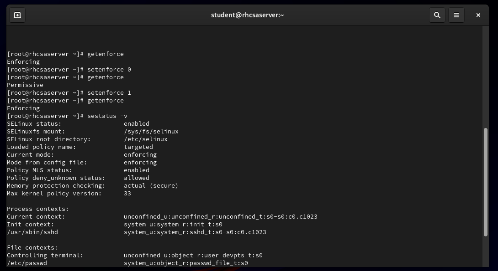
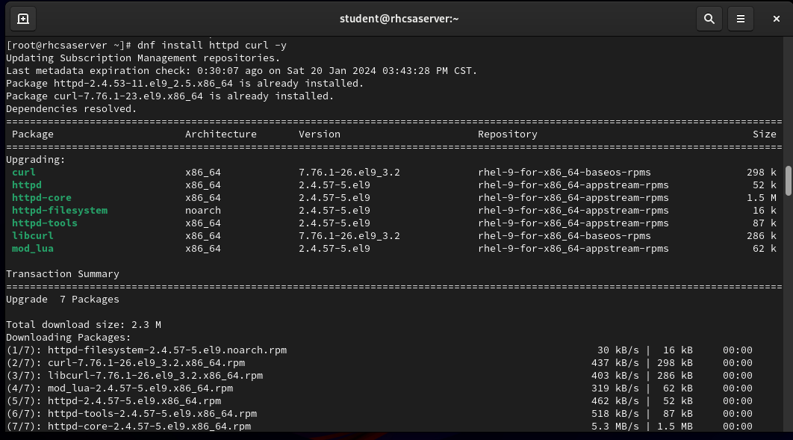
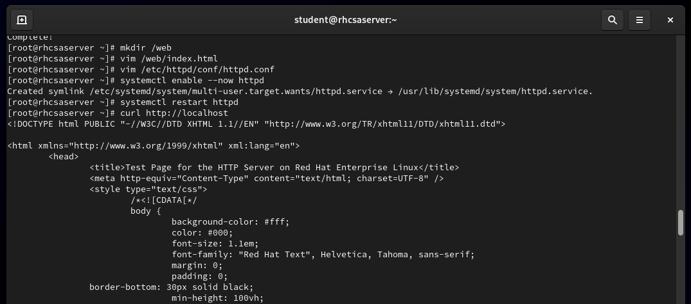
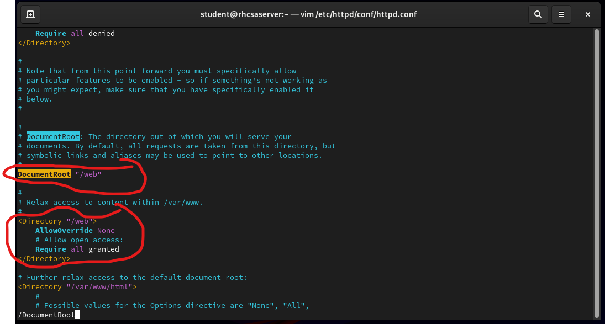

# RHCSA-study
Study notes for the exam.

<h2>Topics covered:</h2>

  <ul>
    <li>Managing physical storage</li>
  <li>Install and configure software components and services</li>
  <li>Establish network connections</li>
  <li>Monitor and manage running processes</li>
  <li>Manage and secure files and file systems</li>
  <li>Administer users and groups</li>
  <li>Review the system log files and journal for issues</li>
  <li>Remotely manage systems with SSH and the Web Console</li>
    <li>Install Red Hat Enterprise Linux using scalable methods</li>
    <li>Access security files, file systems, and networks</li>
    <li>Execute shell scripting and automation techniques</li>
    <li>Manage storage devices, logical volumes, and file systems</li>
    <li>Manage security and system access</li>
    <li>Control the boot process and system services</li>
  </ul>

<h2>Resources: </h2>

  <ul>
    <li>Sander van Vugt RHCSA 9 course</li>
    <li>RHCSA 9 Textbook </li>
    Both can be found on the <a href= "https://learning.oreilly.com"> O'Reilly learning platform.</a>
    <li>Red Hat System Administration I (RH124)</li>
    <li>Red Hat System Administration II (RH134)</li>
  </ul>

<h3>Using vim</h3> 

Create file by using the command "vim <file name> "

When in Vim use "i" to get to INSERT mode and begin typing.

 
o = new line

    
ctrl + c = command mode

  
v = visual mode

  
dd = delete current line

  
gg = top of the document

  
^ = start of the line

  
:wq = save and exit

<h3>File System</h3>

Files on a Linux system are organized into a single file-system hierarchy

mkdir (make directory), rmdir (remove directory), cp (copy), and mv (move) are commands to manage files.

Hard links

Soft links

<h2>Configuration Files</h2>
<h3>Important File Locations</h3>
<ul>
  <li>Source File: ~/.bashrc</li>
  <li>Password Config: /etc/login.defs/user</li>
  <li>Sudo Config: /etc/sudoers.d/user</li>
  <li>Password info: /etc/passwd</li>
  <li>Group info: /etc/group</li>
  <li>SSH Config & Password Auth: /etc/ssh/sshd_config</li>
  
</ul>

<h3>Configure Users and Permissions</h3>
<ul>
  <li>To change a user's password on log in: chage -d 0 user</li>
  <li>Change expiration date for password: chage -M 30 user</li>
  <li>Check user password expiration: chage -l user</li>
  <li>Add user: useradd</li>
  <li>Modify user: usermod</li>
  <li>Add group: groupadd</li>
  <li>Modify group: groupmod</li>
  <li>Change permission: chmod</li>
  <li>Change ownership: chown</li>
</ul>

<h3>File Access</h3>
<ul>
  <li>Read # Write # Execute</li>
  <li>Owning User # Owning Group # Other</li>
</ul>

<h3>Creating Partitions</h3>

<h3> Make File System</h3>

<h3> Unmount a mounted filesystem </h3>

 
<h3> Create a Swap</h3>

<h3> Resize Logical Volumes and Volume Groups</h3>

  
<h3>Schedule Jobs </h3> 

Schedule jobs to run  on a repeating schedule with a user's crontab file. 

 "man at" shows how to execute schedule jobs. These are one time jobs. For example: "at now +3min" runs a job 3 min from now.

"atq" lists scheduled jobs. "atrm" removes the job.

Recurring Jobs: The crond daemon reads multiple config files. Each user has a personal file that they edit with "crontab -e". The fields in the crontab file are in the following order:

<ul>
  <li>Minutes</li>
  <li>Hours</li>
  <li>Day of Month</li>
  <li>Month</li>
  <li>Day of Week</li>
  <li>Command</li>
</ul>

<h3>Manage Temporary Files</h3>

Red Hat includes the systemd-tmpfiles tool - provides a method to manage temporary directories and files. The systemd-tmpfiles-setup service runs the systemd-tmpfiles command.

systemd-tmpfiles-clean service configuration files exist in three places:
/etc/tmpfiles.d/*.conf
/run/tmpfiles.d/*.conf
/usr/lib/tmpfiles.d/*.conf

 In the config file, specify what to do... echo "d/etc/

<h3>Analyze and Store Logs</h3>

The rsyslog service is used to determine for handle log messages. 

The logrotate command rotates log files to prevent them from taking too much space in the /var/log directory. When a log is rotated, it is renamed with an extension.

journalctl retrieves all log messages. 

-r shows the most recent logs

-p shows the priority level

-b shows the current system boot

The system has its own journal located at system.journal. Indiviual users have their own journals pertaining to their own transacions inside of file called user-userid 

Updating Time Zones: Use the command tzselect to view the appropriate time zone. Then use "timedatectl set-timezone" command to set the time zone.

<h3>Manage Compressed tar Archives</h3>

An archive is a file that contains multiple files. "tar" is the command to create manage and extract archives. 

Command: dnf list - lists installed and available packages

 Use dnf install -y software to install 

<h3> Manage Process and jobs</h3>

command & starts a job in the background.
 

Jobs- to view all running jobs 

 A runnable process can be stopped with CTRL+z 

 The ps command shows current running processes 

 The "top" command shows the highest running processes 

 ps -fU user ... for a user's processes 

 Use "Kill" or "killall dd" to kill processes. To kill a ZOMBIE process 

 Process Priorities 

  <ul> 
  <li> Nice and Renice can be used to change priorities of non-realtime processes </li>
  <li> Nice ranges from -20 to 19. Positive values means lower priority.</li>
  <li> Use " Cat /proc/sys/vm/swappiness" to see the value then use "echo _ _ /proc/sys/vm/swappiness" to change it. To make it persistent " cat >> swappiness.conf << EOF" </li>
  <li> loginctl list-user: shows users currently logged in.  loginctl terminate-user: to stop a user session </li> 
  </ul> 

<h2>Systemd</h2>

<ul>
  <li> systemctl edit unit.service : to edit unit files </li>
  <li>systemctl list-dependencies for a complete overview of dependencies</li>
  <li> Mask services : use Systemctl Stop (service) then systemctl mask (service) </li>
  <li>Example: systemctl Status httpd [disabled] ...systemctl enable httpd...</li>
</ul>

<h2> Configure Logging</h2>

<ul>
  <li>Preserve the systemd journal: check settings in /etc/systemd/journal.conf. The setting "STORAGE=AUTO" ensures that persistent storage is happening automatically. Make directory /var/log/journal. Restart service: systemctl restart systemd-journald.</li>
  <li>Logrotate is started by a systemd timer to prevent disks from filling up. "systemctl cat logrotate.conf" to view the settings for logrotate.</li>
  <li>Make sure that the /var/log/journal exists</li>
</ul>

<h2> SELinux </h2>

Security Enhanced Linux (SELinux) provides an additional layer of system security. It should always be enabled. There are two modes: permissive or enforcing. If permissive is enabled, no access is blocked. If enforcing is enabled, all restrictions are applied and SELinux is fully operational. 
 

 
<ul> 
  <li> getenforce shows the current SELinux state. </li> 
  <li> setenforce toggles between enforcing and permissive and sets them temporarily.</li>
  

  <li>To change the default mode persistently, you need to write it to /etc/sysconfig/selinux, or change GRUB kernel boot arguments.</li>
  
  Context management means applying contexts to files.
  <li> File context labels are applied to every Object: user, rule, type</li>
<li>semanage-fcontext : sets the file context label ( - a to set a new context label) ( -m to modify an existing context label ) </li >
<li> When files are copied, they inherit the context type </li>
</ul> 

<h2>Example: Setting Context Labels for Apache Document</h2>

Install curl. 

Make a directory called "web" and create an index.html file within the directory.

 

Then edit the httpd conf file by adding "/web" to the DocumentRoot parameter. Be sure that the following is also added to the file:

 
 

Enable the httpd service and then restart. Curl http://localhost to confirm that SELinux has not been set to permissive and you'll see that this is not your webpage. Use "setenforce 0" and repeat the previous step.

Type semanage fcontext -a -t httpd_sys_content_t "/web(/.*)?" to apply to the directory "/web"

Type  restorecon -R -v /web. The restorecon command restores the default SELinux contexts so that changes made by the "semange fcontext" command are persistent.

<h2>SELinux Rules and Policies</h2>

  <ul>
    <li>SELinux Booleans change the behavior of a rule. To change a Boolean, you can use "setsebool". To list all Booleans - "getsebool -a" or "semanage boolean -l" </li>
    <li>To view logging, you need to access the audit log - "/var/log/audit/audit.log"... SELinux type is AVC so "grep AVC /var/log/audit/audit.log" will show the SELinux logs.</li>
    <li>To understand the logs further, you can use "sealert -l UUID" for more information.</li>
  </ul>

<h2>Firewalld</h2>

Firewalld is a service that can configure firewall rules by using different interfaces. Administrators can manage rules but rules can also be added or removed without any direct action required of the system administrator.

A zone is a collection of rules applied to incoming packets matching a specific source address or network interface.

A Firewalld service - what should be accepted as incoming and outgoing traffic in the firewall. It typically includes ports to be opened, & kernel modules

firewall-cmd -- is the cmd line tool used for firewall configuration.

<h2>Example: Configuring Automount</h2>

This example will show how to mount NFS server and NFS data automatically

  <ul>
    <li>dnf install -y autofs</li>
    <li>cd /etc/ </li>
    <li>vim auto.master (add /nfsdata    /etc/auto.nfsdata at the top of the file)</li>
    <li>vim auto.misc </li>
    <li>vim auto.nfsdata (files    -rw    nfsserver:/nfsdata)</li>
    <li>systemctl enable --now autofs</li>
    <li>ls /</li>
    <li>cd /nfsdata</li>
    <li>ls -al</li>
    <li>cd files</li>
    <li>mount | tail -3 (this will show the automount that was created)</li>
  </ul>

<h3>Example: Automount on Home Directories</h3>

  <ul>
    <li>showmount -e nfsserver: to check what is currently mounted</li>
    <li>vim /etc/auto.master (/homes    /etc/auto.homes)</li>
    <li>vim /etc/auto.homers (*    -rw    nfsserver:/home/ldap/&)</li>
    <li>systemctl restart autofs</li>
    <li>cd /homes</li>
    <li>ls -a</li>
  </ul>

<h2>Containers</h2>
<h3>A container has all that is needed to run an application. They are started from container images. Images are provided in image registries.</h3>

Features:

  <ul>
    <li>Control groups - set limits to the amount of resources that can be used</li>
    <li>Namespaces - provide isolation so that containers only have access to their data and configuration</li>
</ul>

Containers need a user ID to be started. Root containers are started by the root users. Rootless containers are started by non-root users.

Normally each container runs one application.

Podman manages containers and container images

Container images are used to package container applications with all of their dependencies.

podman login registry.redhat.io

Configure Registry Access

  <ul>
    <li>Registry access is configured in /etc/containers/registries.conf</li>
    <li>Container file - text file with instructions to build a custom container image</li>
    <li>dnf install container-tools (view all supporting tools to work with containers)</li>
  </ul>

git clone repository

Move to the directory with the repo files: cd /rhcsa ... and list the files

cat Containerfile

podman images then podman info to see all of the registries

podman login registry.access.redhat.com

