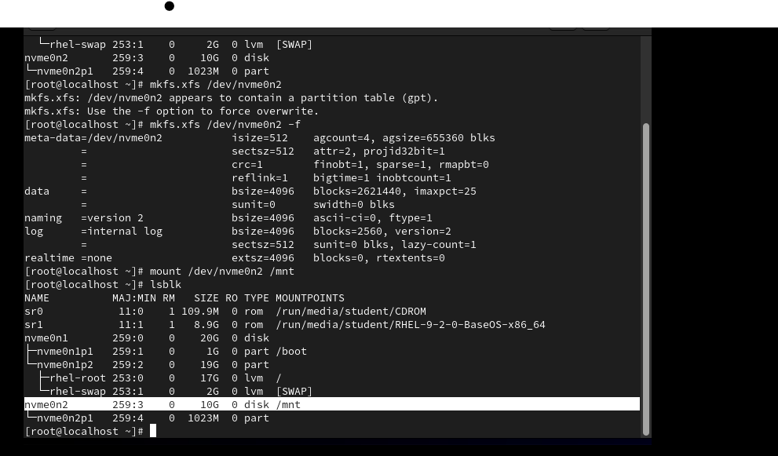
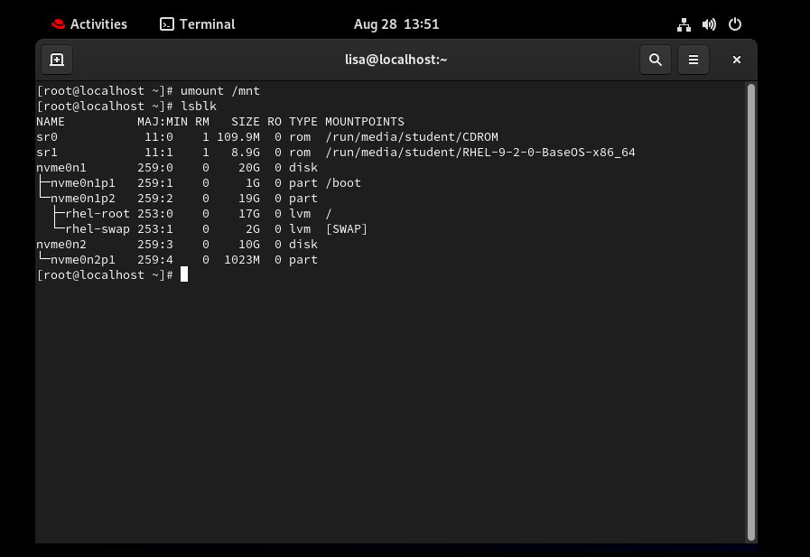
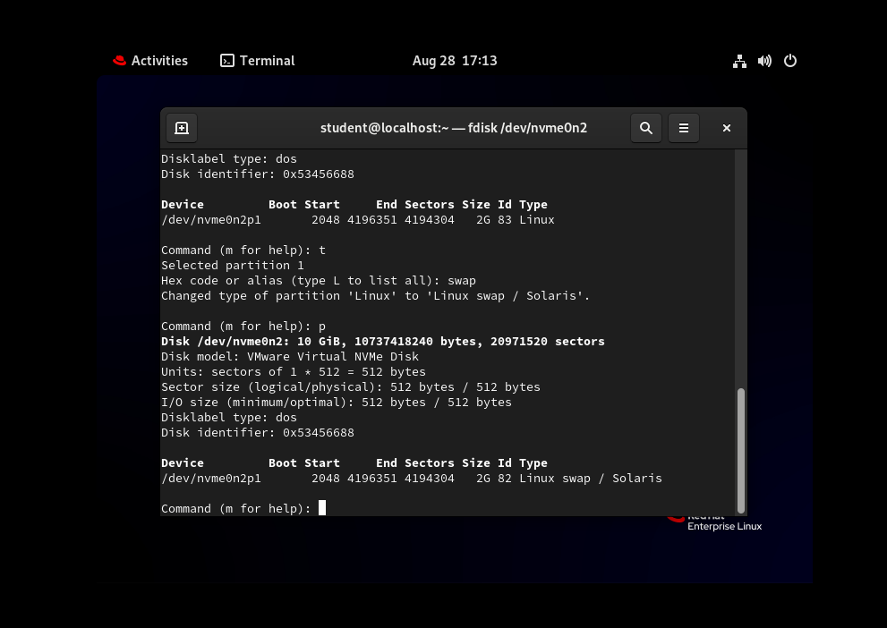
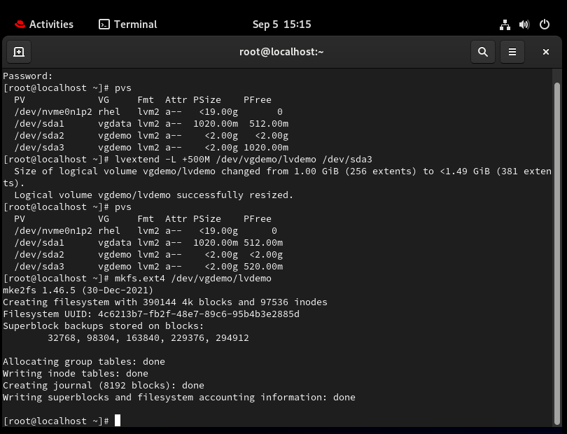

# RHCSA-study
Study notes for the exam.

<h2>Topics covered:</h2>

  <ul>
    <li>Managing physical storage</li>
  <li>Install and configure software components and services</li>
  <li>Establish network connections</li>
  <li>Monitor and manage running processes</li>
  <li>Manage and secure files and file systems</li>
  <li>Administer users and groups</li>
  <li>Review the system log files and journal for issues</li>
  <li>Remotely manage systems with SSH and the Web Console</li>
    <li>Install Red Hat Enterprise Linux using scalable methods</li>
    <li>Access security files, file systems, and networks</li>
    <li>Execute shell scripting and automation techniques</li>
    <li>Manage storage devices, logical volumes, and file systems</li>
    <li>Manage security and system access</li>
    <li>Control the boot process and system services</li>
  </ul>

<h2>Resources: </h2>

  <ul>
    <li>Sander van Vugt RHCSA 9 course</li>
    <li>RHCSA 9 Textbook </li>
    Both can be found on the <a href= "https://learning.oreilly.com"> O'Reilly learning platform.</a>
    <li>Red Hat System Administration I (RH124)</li>
    <li>Red Hat System Administration II (RH134)</li>
  </ul>

<h3>Using vim</h3> 

Create file by using the command "vim <file name> "

When in vim use "i" to get to INSERT mode and begin typing.

 
o = new line

    
ctrl + c = command mode

  
v = visual mode

  
dd = delete current line

  
gg = top of the document

  
^ = start of the line

  
:wq = save and exit

<h3>File System</h3>

Files on a linux system are organized into a single file-system hierarchy

mkdir (make directory), rmdir (remove directory), cp (copy), and mv (move) are commands to manage files.

Hard links

Soft links

<h3>Configuration Files</h3>
<h4>Important File Locations</h4>
<ul>
  <li>Source File: ~/.bashrc</li>
  <li>Password Config: /etc/login.defs/user</li>
  <li>Sudo Config: /etc/sudoers.d/user</li>
  <li>Password info: /etc/passwd</li>
  <li>Group info: /etc/group</li>
  <li>SSH Config & Password Auth: /etc/ssh/sshd_config</li>
  
</ul>

<h3>Configure Users and Permissions</h3>
<ul>
  <li>To change a user's password on log in: chage -d 0 user</li>
  <li>Change expiration date for password: chage -M 30 user</li>
  <li>Check user password expiration: chage -l user</li>
  <li>Add user: useradd</li>
  <li>Modify user: usermod</li>
  <li>Add group: groupadd</li>
  <li>Modify group: groupmod</li>
  <li>Change permission: chmod</li>
  <li>Change ownership: chown</li>
</ul>

<h3>File Access</h3>
<ul>
  <li>Read # Write # Execute</li>
  <li>Owning User # Owning Group # Other</li>
</ul>

<h3>Creating Partitions</h3>

<h3> Make File System</h3>

<h3> Unmount a mounted filesystem </h3>

 
<h3> Create a Swap</h3>

<h3> Resize Logical Volumes and Volume Groups</h3>

  
<h3>Schedule Jobs </h3> 

Schedule jobs to run  on a repeating schedule with a user's crontab file. 

 "man at" shows how to execute schedule jobs. These are one time jobs. For example: "at now +3min" runs a job 3 min from now.

"atq" lists scheduled jobs. "atrm" removes the job.

Recurring Jobs: The crond daemon reads multiple config files. Each user has a personal file that they edit with "crontab -e". The fields in the crontab file are in the following order:

<ul>
  <li>Minutes</li>
  <li>Hours</li>
  <li>Day of Month</li>
  <li>Month</li>
  <li>Day of Week</li>
  <li>Command</li>
</ul>

<h3>Manage Temporary Files</h3>

Red Hat includes the systemd-tmpfiles tool - provides a method to manage temporary directories and files. The systemd-tmpfiles-setup service runs the systemd-tmpfiles command.

systemd-tmpfiles-clean service configuration files exist in three places:
/etc/tmpfiles.d/*.conf
/run/tmpfiles.d/*.conf
/usr/lib/tmpfiles.d/*.conf

<h3>Analyze and Store Logs</h3>

The rsyslog service is used to determine for handle log messages. 

The logrotate command rotates log files to prevent them from taking too much space in the /var/log directory. When a log is rotated, it is renamed with an extension.

journalctl retrieves all log messages. 

-r shows the most recent logs

-p shows the priority level

-b shows the current system boot

The system has its own journal located at system.journal. Indiviual users have their own journals pertaining to their own transacions inside of file called user-userid 

Updating Time Zones: Use the command tzselect to view the appropriate time zone. Then use "timedatectl set-timezone" command to set the time zone.

<h3>Manage Compressed tar Archives</h3>

An archive is a file that contains multiple files. "tar" is the command to create manage and extract archives. 

Command: dnf list - lists installed and available packages

 Use dnf install -y software to install 

<h3> Manage Process and jobs</h3>

command & starts ajob in the background.
 

Jobs- to view all running jobs 

 A runnable process can be stopped with CTRL+z 

 The ps command shows current running processes 

 the top command shows the highest running processes 

 ps -fU user ... for a user's processes 

 Use "Kill" or "killall dd" to kill processes. To kill a ZOMBIE process 

 Process Priorities 

  <ul> 
  <li> Nice and Renice can be used to change priorities of non realtime processes </li>
  <li> Nice ranges from -20 to 19. Positive values means lower priority.</li>
  <li> Use " Cat /proc/sys/vm/swappiness" to see the value then use "echo _ _ /proc/sys/vm/swappiness" to change it. To make it persistent " cat >> swappiness.conf << EOF" </li>
  <li> loginctl list-user : shows users currently loggedin.  loginctl terminate-user:to stop a user session </li> 
  
  </ul> 

